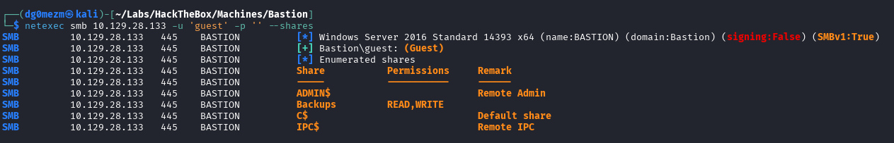
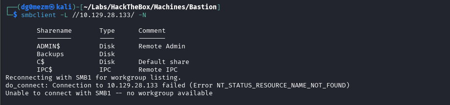
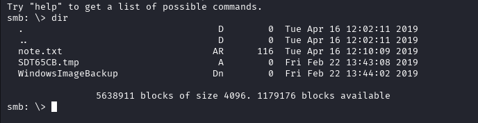
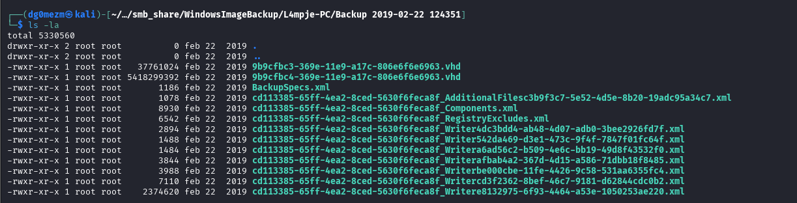

## Reconocimiento

Realizamos un ping para verificar que tenemos trazabilidad con la máquina, además, podemos observar el valor del `ttl` para determinar el posible sistema operativo al que nos estamos enfrentando, aunque esto no lo confirma definitivamente:

```bash
ping -c 1 10.129.28.133 > enum/ping.txt

PING 10.129.28.133 (10.129.28.133) 56(84) bytes of data.
64 bytes from 10.129.28.133: icmp_seq=1 ttl=127 time=48.5 ms

--- 10.129.28.133 ping statistics ---
1 packets transmitted, 1 received, 0% packet loss, time 0ms
rtt min/avg/max/mdev = 48.463/48.463/48.463/0.000 ms
```

### Enumeración de puertos

Ahora procedemos a realizar un escaeno de puertos, tanto UDP como TCP, para ello usaremos `nmap` realizando un `SYN-Scan` e indicando el parámetro `-p-` para enumerar todo el rango de puertos:

```bash
sudo nmap -sS -p- -T5 10.129.28.133 --open -Pn -oN enum/all_ports.txt -oG enum/all_ports.grep

# Nmap 7.95 scan initiated Fri Apr  4 14:13:32 2025 as: /usr/lib/nmap/nmap -sS -p- -T5 --open -Pn -oN enum/all_ports.txt -oG enum/all_ports.grep 10.129.28.133
Warning: 10.129.28.133 giving up on port because retransmission cap hit (2).
Nmap scan report for 10.129.28.133
Host is up (0.050s latency).
Not shown: 65417 closed tcp ports (reset), 105 filtered tcp ports (no-response)
Some closed ports may be reported as filtered due to --defeat-rst-ratelimit
PORT      STATE SERVICE
22/tcp    open  ssh
135/tcp   open  msrpc
139/tcp   open  netbios-ssn
445/tcp   open  microsoft-ds
5985/tcp  open  wsman
47001/tcp open  winrm
49664/tcp open  unknown
49665/tcp open  unknown
49666/tcp open  unknown
49667/tcp open  unknown
49668/tcp open  unknown
49669/tcp open  unknown
49670/tcp open  unknown

# Nmap done at Fri Apr  4 14:14:30 2025 -- 1 IP address (1 host up) scanned in 58.45 seconds
```

Como mencionamos anteriormente, también realizaremos un escaeno de los puertos UDP usando `nmap` indicando el parámetro `-sU`:

```bash
sudo nmap -sU -T5 10.129.28.133 --open -Pn -oN enum/nmap_udp_ports.txt

# Nmap 7.95 scan initiated Fri Apr  4 14:13:38 2025 as: /usr/lib/nmap/nmap -sU -T5 --open -Pn -oN enum/nmap_udp_ports.txt 10.129.28.133
Warning: 10.129.28.133 giving up on port because retransmission cap hit (2).
Nmap scan report for 10.129.28.133
Host is up (0.048s latency).
All 1000 scanned ports on 10.129.28.133 are in ignored states.
Not shown: 881 open|filtered udp ports (no-response), 119 closed udp ports (port-unreach)

# Nmap done at Fri Apr  4 14:15:44 2025 -- 1 IP address (1 host up) scanned in 126.43 seconds
```

### Enumeración de Servicios

Ahora que ya conocemos los puertos que están abiertos en la máquina, procederemos a enumerar que servicios están corriendo en dichos puertos, para ello, utilizaremos `nmap` con el parámetro `-sCV` para enumerar la versión de los servicios y a su vez, utilizar algunos scripts básicos de reconocimiento:

```bash
sudo nmap -sCV -p22,135,139,445,5985,47001,49664,49665,49666,49667,49668,49669,49670 -A 10.129.28.133 -Pn -oN enum/all_services.txt

# Nmap 7.95 scan initiated Fri Apr  4 14:15:23 2025 as: /usr/lib/nmap/nmap -sCV -p22,135,139,445,5985,47001,49664,49665,49666,49667,49668,49669,49670 -A -Pn -oN enum/all_services.txt 10.129.28.133
Nmap scan report for 10.129.28.133
Host is up (0.048s latency).

PORT      STATE SERVICE      VERSION
22/tcp    open  ssh          OpenSSH for_Windows_7.9 (protocol 2.0)
| ssh-hostkey: 
|   2048 3a:56:ae:75:3c:78:0e:c8:56:4d:cb:1c:22:bf:45:8a (RSA)
|   256 cc:2e:56:ab:19:97:d5:bb:03:fb:82:cd:63:da:68:01 (ECDSA)
|_  256 93:5f:5d:aa:ca:9f:53:e7:f2:82:e6:64:a8:a3:a0:18 (ED25519)
135/tcp   open  msrpc        Microsoft Windows RPC
139/tcp   open  netbios-ssn  Microsoft Windows netbios-ssn
445/tcp   open  microsoft-ds Windows Server 2016 Standard 14393 microsoft-ds
5985/tcp  open  http         Microsoft HTTPAPI httpd 2.0 (SSDP/UPnP)
|_http-server-header: Microsoft-HTTPAPI/2.0
|_http-title: Not Found
47001/tcp open  http         Microsoft HTTPAPI httpd 2.0 (SSDP/UPnP)
|_http-server-header: Microsoft-HTTPAPI/2.0
|_http-title: Not Found
49664/tcp open  msrpc        Microsoft Windows RPC
49665/tcp open  msrpc        Microsoft Windows RPC
49666/tcp open  msrpc        Microsoft Windows RPC
49667/tcp open  msrpc        Microsoft Windows RPC
49668/tcp open  msrpc        Microsoft Windows RPC
49669/tcp open  msrpc        Microsoft Windows RPC
49670/tcp open  msrpc        Microsoft Windows RPC
Warning: OSScan results may be unreliable because we could not find at least 1 open and 1 closed port
Device type: general purpose
Running: Microsoft Windows 2016
OS CPE: cpe:/o:microsoft:windows_server_2016
OS details: Microsoft Windows Server 2016
Network Distance: 2 hops
Service Info: OSs: Windows, Windows Server 2008 R2 - 2012; CPE: cpe:/o:microsoft:windows

Host script results:
| smb-os-discovery: 
|   OS: Windows Server 2016 Standard 14393 (Windows Server 2016 Standard 6.3)
|   Computer name: Bastion
|   NetBIOS computer name: BASTION\x00
|   Workgroup: WORKGROUP\x00
|_  System time: 2025-04-04T14:16:24+02:00
| smb-security-mode: 
|   account_used: guest
|   authentication_level: user
|   challenge_response: supported
|_  message_signing: disabled (dangerous, but default)
| smb2-security-mode: 
|   3:1:1: 
|_    Message signing enabled but not required
| smb2-time: 
|   date: 2025-04-04T12:16:22
|_  start_date: 2025-04-04T12:07:06
|_clock-skew: mean: -39m59s, deviation: 1h09m14s, median: -1s

TRACEROUTE (using port 135/tcp)
HOP RTT      ADDRESS
1   48.56 ms 10.10.14.1
2   48.78 ms 10.129.28.133

OS and Service detection performed. Please report any incorrect results at https://nmap.org/submit/ .
# Nmap done at Fri Apr  4 14:16:31 2025 -- 1 IP address (1 host up) scanned in 68.13 seconds
```

Como podemos observar, vemos que en la máquina hay un servidor `SSH` con versión `OpenSSH for_Windows_7.9` en el puerto `22/tcp`, tiene expuestos el puerto `135/tcp` que corresponde con el servicio `RPC`, también tiene los puertos `139/tcp` y `445/tcp` que se corresponden con el servicio de `NetBIOS` y con el servicio `SMB`, respectivamente. El resto de puertos se corresponden con servicios de `Windows` como por ejemplo, `WinRM`, que podríamos utilizar en caso de que encontremos las credenciales de un usuario que tenga permitido acceder usando este servicio o pertenezca al grupo `Remote Management Users`.

Ahora lo que tendremos que hacer será revisar dichos servicios y recopilar información para poder encontrar algún vector de ataque que nos permita obtener acceso a ejecución de comandos o acceso a algún usuario.

#### 445/tcp - SMB

Enumeraremos las unidades compartidas en red y comprobaremos si está habilitado que podamos enumerarlos con un usuario invitado utilizando `netexec` o `smbclient`. Personalmente, me gusta más utilizar `netexec` ya que el resultado que muestra es más vistoso y podemos obtener algo más de información, como por ejemplo, si tenemos permisos de escritura o lectura en una unidad compartida. Ejecutamos el siguiente comando:

```bash
netexec smb 10.129.28.133 -u 'guest' -p '' --shares
```



Vemos que existe una unidad compartidad llamada `Backups` en la cual tenemos permisos de lectura y de escritura. Aún así, lanzaremos `smbclient` con una `NULL Session` para observar que también obtenemos el mismo resultado, aunque sin la información de los permisos. Ejecutamos el siguiente comando:

```bash
smbclient -L //10.129.28.133/ -N
```



Vemos que obtenemos el mismo resultado, por lo que ahora lo que haremos será comprobar si hay algún fichero que podamos utilizar para encontrar un vector de entrada a la máquina, para ello utilizaremos `smbclient`, nos conectaremos a la unidad de red llamada `Backups` con el siguiente comando y listaremos los ficheros:

```bash
smbclient //10.129.28.133/Backups -N
```



Vemos que hay varios ficheros y directorios, aunque vemos que hay un fichero llamado `note.txt`, lo leeremos para ver si hubiese algún tipo de información útil:

```bash
smb: \> get note.txt 
getting file \note.txt of size 116 as note.txt (0,6 KiloBytes/sec) (average 0,6 KiloBytes/sec)
smb: \> !cat note.txt 

Sysadmins: please don't transfer the entire backup file locally, the VPN to the subsidiary office is too slow.

smb: \>
```

Parece que nos indican que no descarguemos los ficheros de backup, porque el tráfico es muy lento, por lo que tendremos que seguir investigando para encontrar esos backups, entraremos en el directorio llamado `WindowsImageBackup` e iremos el contenido de los ficheros hasta que encontremos algo que nos pueda servir:

```bash
smb: \> cd WindowsImageBackup
smb: \WindowsImageBackup\> dir
  .                                  Dn        0  Fri Feb 22 13:44:02 2019
  ..                                 Dn        0  Fri Feb 22 13:44:02 2019
  L4mpje-PC                          Dn        0  Fri Feb 22 13:45:32 2019

                5638911 blocks of size 4096. 1178388 blocks available
smb: \WindowsImageBackup\> cd L4mpje-PC
smb: \WindowsImageBackup\L4mpje-PC\> dir
  .                                  Dn        0  Fri Feb 22 13:45:32 2019
  ..                                 Dn        0  Fri Feb 22 13:45:32 2019
  Backup 2019-02-22 124351           Dn        0  Fri Feb 22 13:45:32 2019
  Catalog                            Dn        0  Fri Feb 22 13:45:32 2019
  MediaId                            An       16  Fri Feb 22 13:44:02 2019
  SPPMetadataCache                   Dn        0  Fri Feb 22 13:45:32 2019

                5638911 blocks of size 4096. 1178190 blocks available
```

Tuvimos que movernos entre varios directorios, aunque finalmente hemos encontrado un directorio llamado `Backup 2019-02-22 124351` que es posible que contenga los ficheros de los backups, procedemos a listar su contenido y ver que podemos hacer:

```bash
smb: \WindowsImageBackup\L4mpje-PC\> cd "Backup 2019-02-22 124351"
smb: \WindowsImageBackup\L4mpje-PC\Backup 2019-02-22 124351\> dir
  .                                  Dn        0  Fri Feb 22 13:45:32 2019
  ..                                 Dn        0  Fri Feb 22 13:45:32 2019
  9b9cfbc3-369e-11e9-a17c-806e6f6e6963.vhd     An 37761024  Fri Feb 22 13:44:02 2019
  9b9cfbc4-369e-11e9-a17c-806e6f6e6963.vhd     An 5418299392  Fri Feb 22 13:44:03 2019
  BackupSpecs.xml                    An     1186  Fri Feb 22 13:45:32 2019
  cd113385-65ff-4ea2-8ced-5630f6feca8f_AdditionalFilesc3b9f3c7-5e52-4d5e-8b20-19adc95a34c7.xml     An     1078  Fri Feb 22 13:45:32 2019
  cd113385-65ff-4ea2-8ced-5630f6feca8f_Components.xml     An     8930  Fri Feb 22 13:45:32 2019
  cd113385-65ff-4ea2-8ced-5630f6feca8f_RegistryExcludes.xml     An     6542  Fri Feb 22 13:45:32 2019
  cd113385-65ff-4ea2-8ced-5630f6feca8f_Writer4dc3bdd4-ab48-4d07-adb0-3bee2926fd7f.xml     An     2894  Fri Feb 22 13:45:32 2019
  cd113385-65ff-4ea2-8ced-5630f6feca8f_Writer542da469-d3e1-473c-9f4f-7847f01fc64f.xml     An     1488  Fri Feb 22 13:45:32 2019
  cd113385-65ff-4ea2-8ced-5630f6feca8f_Writera6ad56c2-b509-4e6c-bb19-49d8f43532f0.xml     An     1484  Fri Feb 22 13:45:32 2019
  cd113385-65ff-4ea2-8ced-5630f6feca8f_Writerafbab4a2-367d-4d15-a586-71dbb18f8485.xml     An     3844  Fri Feb 22 13:45:32 2019
  cd113385-65ff-4ea2-8ced-5630f6feca8f_Writerbe000cbe-11fe-4426-9c58-531aa6355fc4.xml     An     3988  Fri Feb 22 13:45:32 2019
  cd113385-65ff-4ea2-8ced-5630f6feca8f_Writercd3f2362-8bef-46c7-9181-d62844cdc0b2.xml     An     7110  Fri Feb 22 13:45:32 2019
  cd113385-65ff-4ea2-8ced-5630f6feca8f_Writere8132975-6f93-4464-a53e-1050253ae220.xml     An  2374620  Fri Feb 22 13:45:32 2019
```

Vemos que hay varios ficheros, aunque los que más deberían llamarnos la antención son aquellos que tienen la extensión `.vhd`, ya que deberían ser la clonación del disco duro que se haya realizado como backup, por ello, lo que podríamos hacer es montar en un directorio de nuestra máquina la unidad compartida del servicio `SMB` y después utilizar la herramienta `guestmount` para intentar leer el contenido de estos backups. Empezaremos montando la unidad compartida en una carpeta que crearemos llamada `smb_share` usando el comando `mount` con permisos de `sudo` para que no tengamos ningún problema y luego nos moveremos hasta el directorio donde se encontraban los ficheros `.vhd` para comprobar que lo hemos hecho correctamente:

```bash
mkdir smb_share
sudo mount -t cifs //10.129.28.133/Backups ./smb_share -o rw -o username=guest
```



